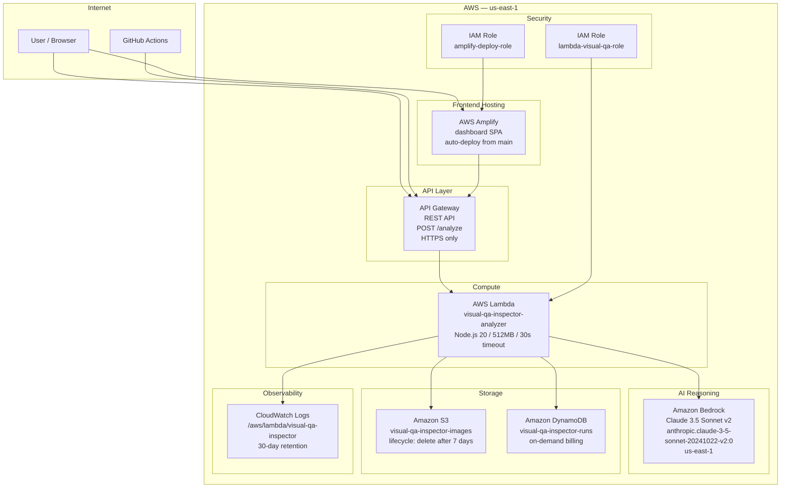
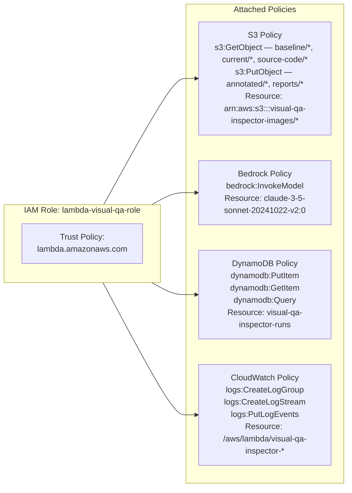
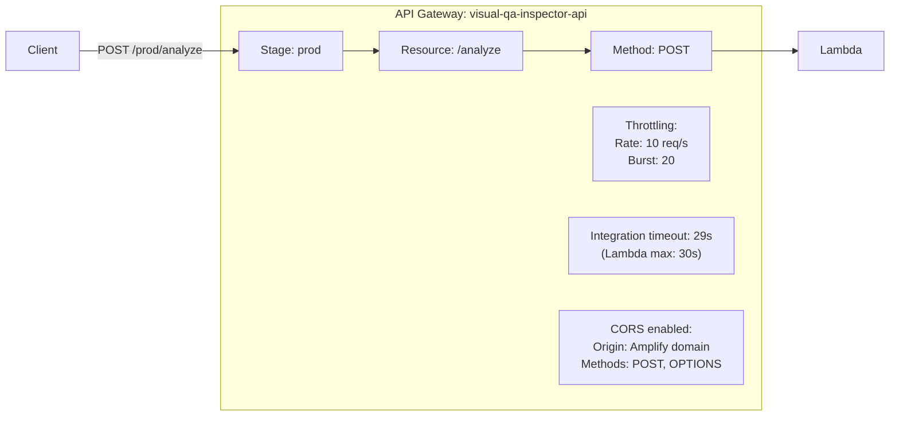
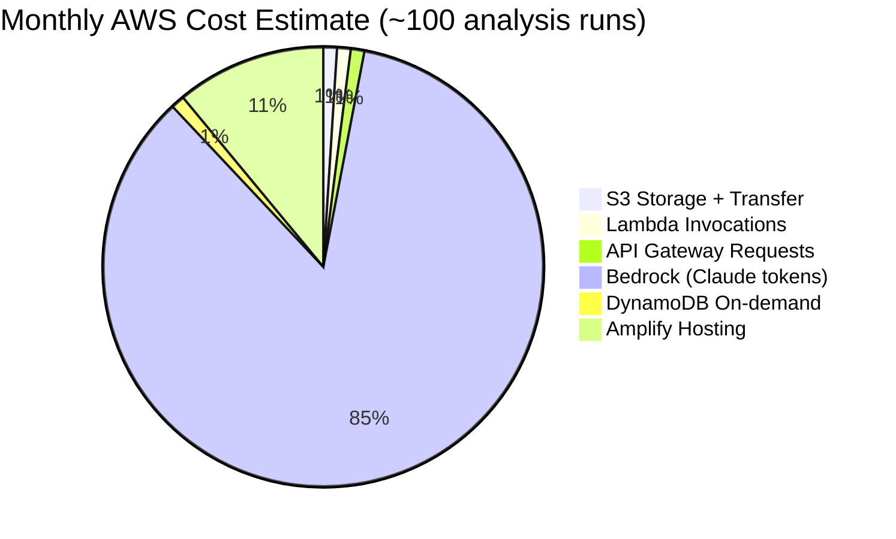

# AWS Infrastructure — VisualQA Inspector

> All AWS services, their configurations, relationships, and IAM permissions.

---

## Infrastructure Overview



---

## IAM Permissions



---

## S3 Bucket Structure

```mermaid
graph TD
    BUCKET[S3 Bucket<br/>visual-qa-inspector-images]

    BUCKET --> BASE[/baseline/]
    BUCKET --> CUR[/current/]
    BUCKET --> SRC[/source-code/]
    BUCKET --> ANN[/annotated/]
    BUCKET --> RPT[/reports/]

    BASE --> BASE_RUN[/{run-id}/]
    BASE_RUN --> BASE_DESK[/desktop/screenshot.png]
    BASE_RUN --> BASE_MOB[/mobile/screenshot.png]

    CUR --> CUR_RUN[/{run-id}/]
    CUR_RUN --> CUR_DESK[/desktop/screenshot.png]
    CUR_RUN --> CUR_MOB[/mobile/screenshot.png]

    SRC --> SRC_RUN[/{run-id}/]
    SRC_RUN --> SRC_JSX[/ComponentName.jsx]
    SRC_RUN --> SRC_CSS[/ComponentName.css]

    ANN --> ANN_RUN[/{run-id}/]
    ANN_RUN --> ANN_DESK[/desktop/screenshot-annotated.png]
    ANN_RUN --> ANN_MOB[/mobile/screenshot-annotated.png]

    RPT --> RPT_RUN[/{run-id}/]
    RPT_RUN --> RPT_JSON[/report.json]
```

---

## DynamoDB Table Design

```mermaid
erDiagram
    RUNS {
        string runId PK "Partition Key — UUID"
        string timestamp SK "Sort Key — ISO 8601"
        string mode "regression OR intent OR accessibility"
        string overallSeverity "critical OR minor OR cosmetic OR pass"
        string reportUrl "S3 URL to report.json"
        number diffsFound "total diffs across all viewports"
        string prNumber "GitHub PR number if CI-triggered"
        string repoFullName "owner/repo if CI-triggered"
        string triggeredBy "ci OR manual"
        number durationMs "analysis duration in milliseconds"
        string baselinePrefix "S3 prefix for baseline images"
        string currentPrefix "S3 prefix for current images"
    }
```

---

## API Gateway Configuration



---

## Cost Estimate (Hackathon Scale)



> Estimated total: **~$5–15/month** at hackathon scale (100 runs/month).
> Bedrock cost dominates — Claude 3.5 Sonnet charges per input/output token.
> Each multimodal analysis call (2 images + prompt) ≈ $0.05–0.15 depending on image size.
