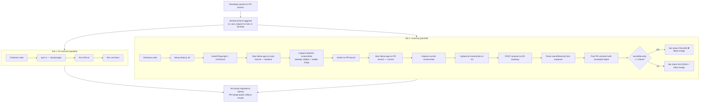
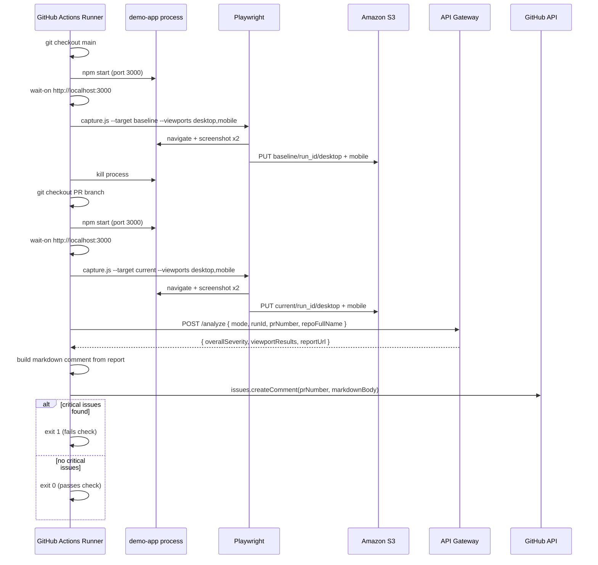
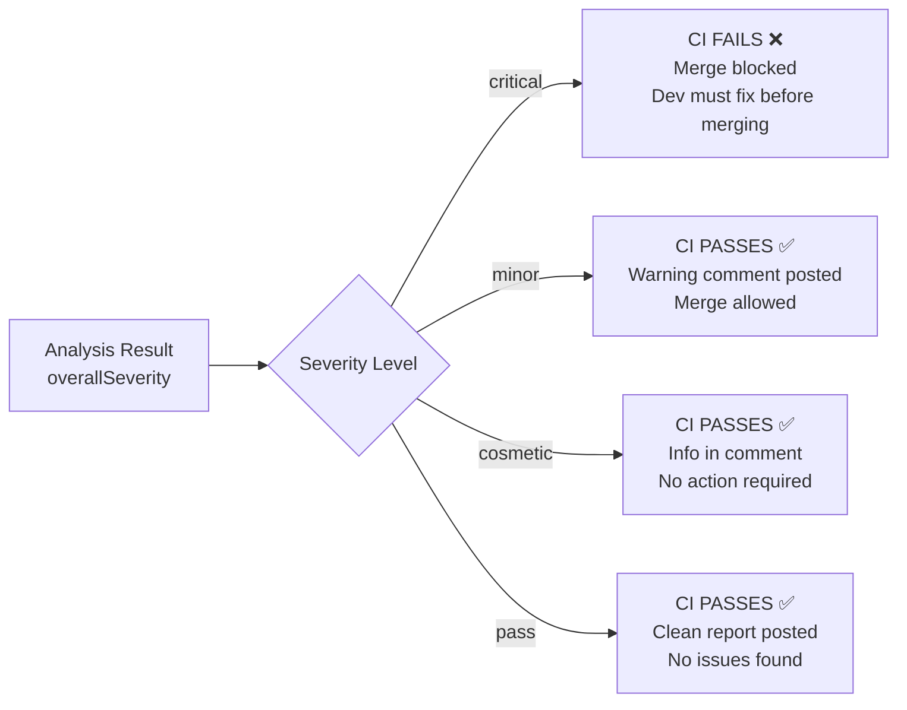
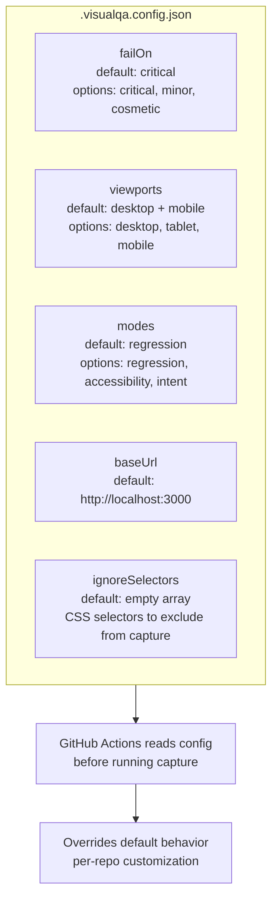
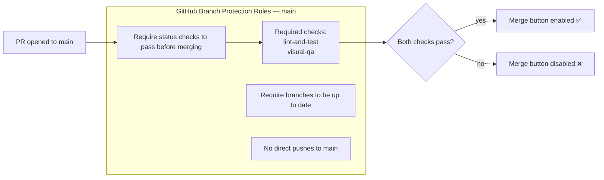

# CI Pipeline — VisualQA Inspector

> GitHub Actions workflow design, job dependencies, and quality gate logic.

---

## Pipeline Overview



---

## Job 2 Detail — Visual QA Steps



---

## Quality Gate Logic



---

## Config File — `.visualqa.config.json`

Placed in the root of any repo using VisualQA Inspector CI.



Example config:
```json
{
  "failOn": "critical",
  "viewports": ["desktop", "mobile"],
  "modes": ["regression", "accessibility"],
  "baseUrl": "http://localhost:3000",
  "ignoreSelectors": [".cookie-banner", "#ad-container", ".timestamp"]
}
```

---

## Branch Protection Integration


