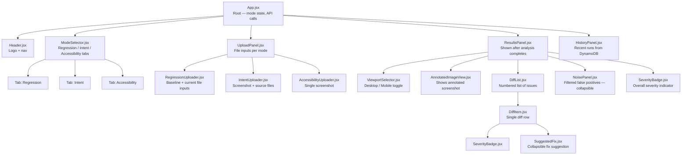
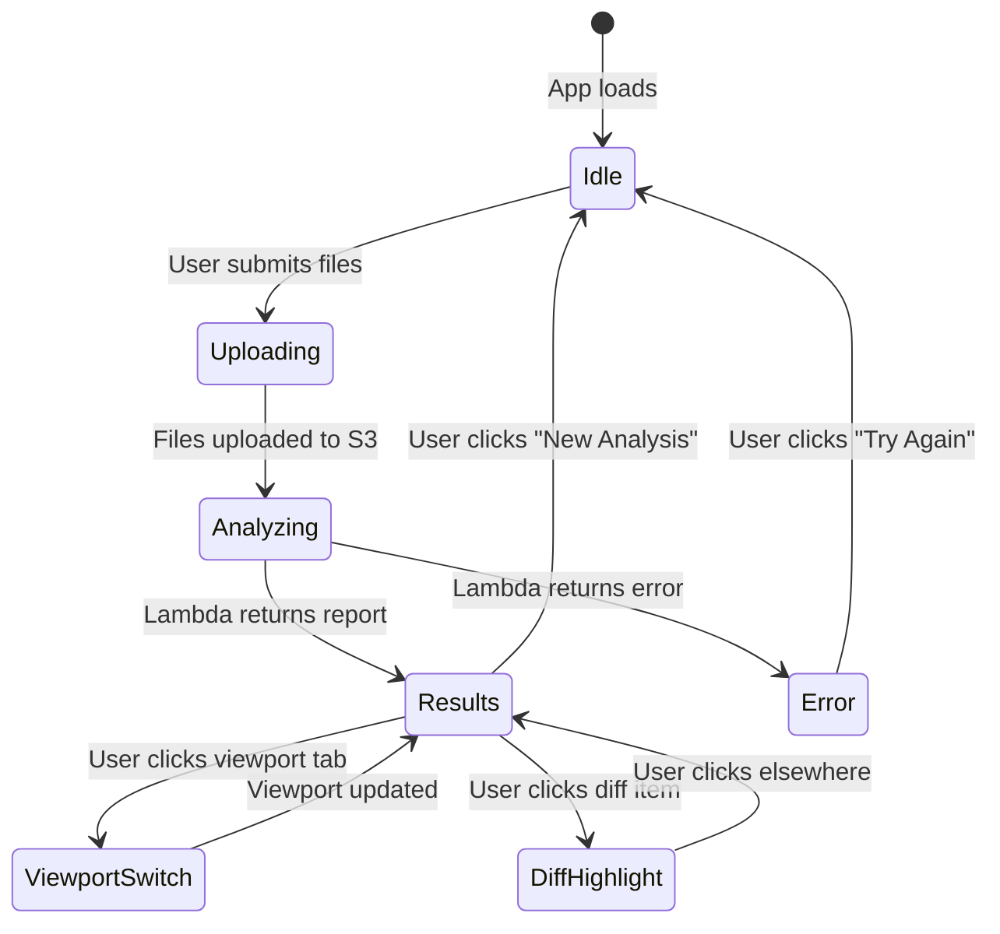
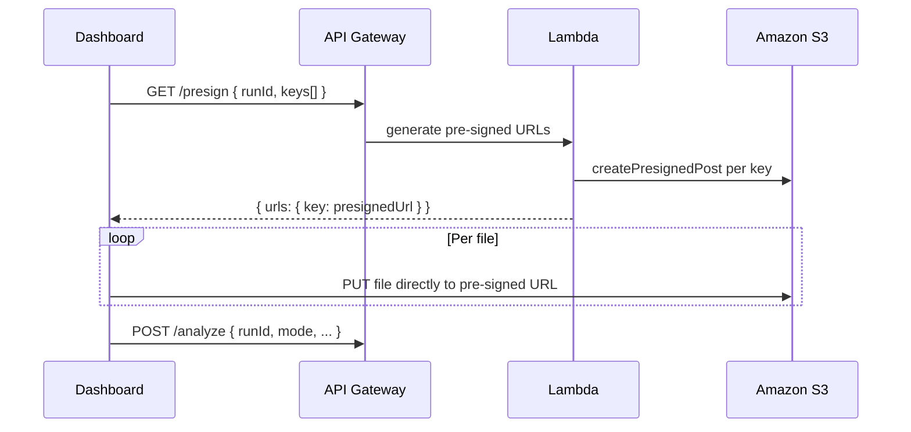
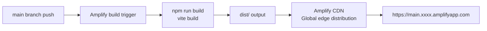

# Component Design — React Dashboard

> Web UI for manual analysis submissions and viewing results. Deployed on AWS Amplify.

---

## Component Tree



---

## State Management



---

## Component Specifications

### `ModeSelector.jsx`
- Renders three tab buttons
- Active tab stored in `App` state: `mode: 'regression' | 'intent' | 'accessibility'`
- Tab switch resets upload state and results state

### `AnnotatedImageView.jsx`
- Receives `annotatedImageUrl` from results
- Renders `` tag — bounding boxes are pre-drawn on server side
- On hover over a bounding box area, highlights the corresponding diff in `DiffList`
- Uses an invisible overlay grid mapped from `bbox` coordinates to enable hover detection
- Scales image to fit container, preserves aspect ratio

### `DiffList.jsx`
- Renders numbered list sorted by severity: critical first, then minor, then cosmetic
- Each item shows: number badge, description, severity badge, WCAG rule (accessibility mode only)
- Clicking an item scrolls `AnnotatedImageView` to the corresponding bbox
- `SuggestedFix` is collapsed by default, expands on click

### `NoisePanel.jsx`
- Only shown in regression mode when `noiseFiltered` field is present in response
- Collapsed by default with label "Filtered Noise — not flagged (click to expand)"
- Expands to show the noise_filtered explanation from Bedrock
- Styled with muted gray — visually distinct from the diffs list

### `HistoryPanel.jsx`
- Fetches `GET /history` endpoint which queries DynamoDB for last 10 runs
- Shows: run date, mode, overall severity badge, link to re-view report
- Loads on mount, refreshes after each new analysis

---

## API Service — `services/api.js`

### Endpoints

```javascript
// Trigger analysis
POST /analyze
Body: { mode, runId, baselinePrefix, currentPrefix, sourcePrefix }
Returns: { runId, overallSeverity, viewportResults, reportUrl, durationMs }

// Get run history
GET /history?limit=10
Returns: { runs: [{ runId, timestamp, mode, overallSeverity, reportUrl }] }
```

### Upload Flow (pre-analysis)
The dashboard uploads files directly to S3 via pre-signed URLs to avoid routing large binary files through Lambda:



---

## Routing

```mermaid
graph LR
    HOME[/ — Home<br/>Mode selector + upload]
    REPORT[/report/:runId — Report view<br/>Loads specific run from DynamoDB]
    HISTORY[/history — History<br/>All past runs]

    HOME -- analysis complete --> REPORT
    HISTORY -- click run --> REPORT
    REPORT -- new analysis --> HOME
```

---

## Responsive Breakpoints

| Breakpoint | Layout |
|---|---|
| < 640px (mobile) | Single column — image above diff list |
| 640–1024px (tablet) | Single column — viewport selector shown |
| > 1024px (desktop) | Two column — image left, diff list right |

---

## Dependencies

```json
{
  "dependencies": {
    "react": "18.x",
    "react-dom": "18.x",
    "react-router-dom": "6.x",
    "axios": "1.x",
    "tailwindcss": "3.x",
    "@headlessui/react": "1.x",
    "clsx": "2.x"
  },
  "devDependencies": {
    "vite": "5.x",
    "@vitejs/plugin-react": "4.x",
    "autoprefixer": "10.x",
    "postcss": "8.x"
  }
}
```

---

## Amplify Deployment



### `amplify.yml`
```yaml
version: 1
frontend:
  phases:
    preBuild:
      commands:
        - cd dashboard
        - npm ci
    build:
      commands:
        - npm run build
  artifacts:
    baseDirectory: dashboard/dist
    files:
      - "**/*"
  cache:
    paths:
      - dashboard/node_modules/**/*
```
