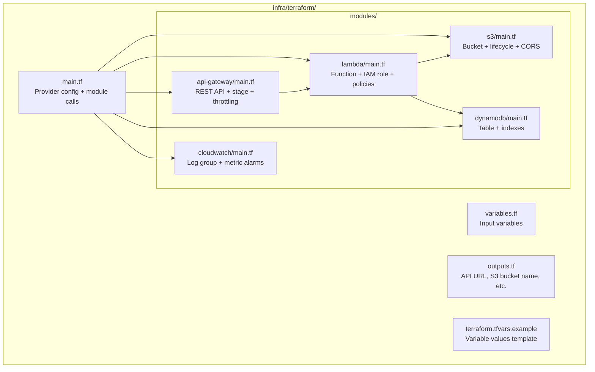
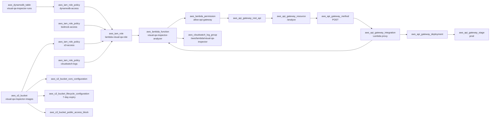
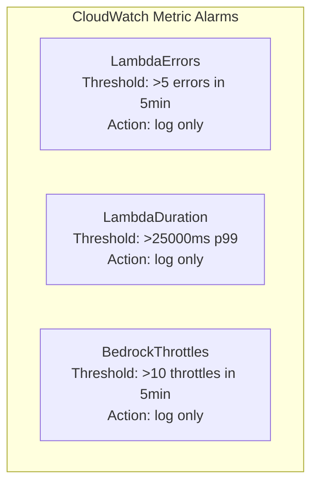

# Component Design — Infrastructure

> Terraform configuration for all AWS resources. Manages S3, Lambda, API Gateway, DynamoDB, IAM, and CloudWatch.

---

## Terraform Module Structure



---

## Resource Dependency Graph



---

## Key Resource Configurations

### S3 Bucket

```hcl
resource "aws_s3_bucket" "images" {
  bucket = "visual-qa-inspector-images-${var.environment}"
}

resource "aws_s3_bucket_lifecycle_configuration" "images" {
  bucket = aws_s3_bucket.images.id
  rule {
    id     = "expire-screenshots"
    status = "Enabled"
    expiration { days = 7 }
  }
}

resource "aws_s3_bucket_cors_configuration" "images" {
  bucket = aws_s3_bucket.images.id
  cors_rule {
    allowed_headers = ["*"]
    allowed_methods = ["GET", "PUT", "POST"]
    allowed_origins = [var.dashboard_origin]
    max_age_seconds = 3000
  }
}
```

### Lambda Function

```hcl
resource "aws_lambda_function" "analyzer" {
  function_name = "visual-qa-inspector-analyzer-${var.environment}"
  runtime       = "nodejs20.x"
  handler       = "src/index.handler"
  role          = aws_iam_role.lambda.arn
  timeout       = 30
  memory_size   = 512
  architectures = ["arm64"]

  filename         = data.archive_file.lambda_zip.output_path
  source_code_hash = data.archive_file.lambda_zip.output_base64sha256

  environment {
    variables = {
      S3_BUCKET_NAME     = aws_s3_bucket.images.bucket
      DYNAMODB_TABLE_NAME = aws_dynamodb_table.runs.name
      BEDROCK_MODEL_ID   = "anthropic.claude-3-5-sonnet-20241022-v2:0"
      AWS_REGION_NAME    = var.aws_region
    }
  }
}
```

### DynamoDB Table

```hcl
resource "aws_dynamodb_table" "runs" {
  name         = "visual-qa-inspector-runs-${var.environment}"
  billing_mode = "PAY_PER_REQUEST"
  hash_key     = "runId"
  range_key    = "timestamp"

  attribute {
    name = "runId"
    type = "S"
  }
  attribute {
    name = "timestamp"
    type = "S"
  }
  attribute {
    name = "overallSeverity"
    type = "S"
  }

  global_secondary_index {
    name            = "severity-timestamp-index"
    hash_key        = "overallSeverity"
    range_key       = "timestamp"
    projection_type = "ALL"
  }

  ttl {
    attribute_name = "ttl"
    enabled        = true
  }
}
```

---

## Input Variables

| Variable | Type | Default | Description |
|---|---|---|---|
| `aws_region` | string | `us-east-1` | AWS region for all resources |
| `environment` | string | `prod` | Environment suffix for resource names |
| `dashboard_origin` | string | `*` | Allowed CORS origin for S3 (set to Amplify URL) |
| `lambda_zip_path` | string | — | Path to Lambda deployment zip |
| `bedrock_model_id` | string | `anthropic.claude-3-5-sonnet-20241022-v2:0` | Bedrock model to use |

---

## Outputs

| Output | Description |
|---|---|
| `api_gateway_url` | Base URL for POST /analyze — set as `REACT_APP_API_URL` in Amplify |
| `s3_bucket_name` | Bucket name — set as `S3_BUCKET_NAME` in GitHub Secrets |
| `dynamodb_table_name` | Table name |
| `lambda_function_arn` | Lambda ARN |
| `cloudwatch_log_group` | Log group name for debugging |

---

## Deployment Commands

```bash
cd infra/terraform

# First time setup
terraform init

# Preview changes
terraform plan -var-file="terraform.tfvars"

# Apply
terraform apply -var-file="terraform.tfvars"

# Tear down (after hackathon)
terraform destroy -var-file="terraform.tfvars"
```

---

## CloudWatch Alarms



Alarms are informational only — no SNS notifications to keep setup simple for the hackathon.
