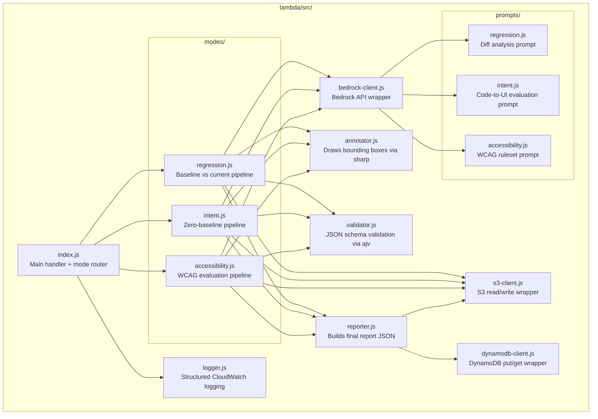
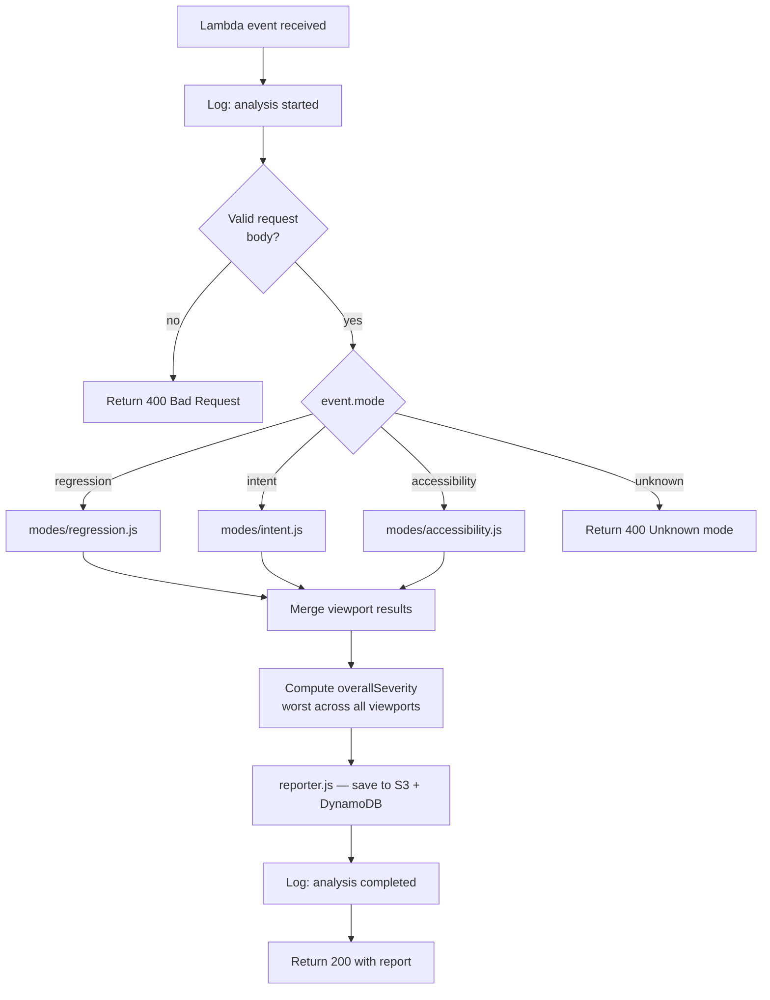
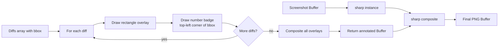

# Component Design — Lambda Orchestrator

> Core backend service. Routes analysis requests to the correct mode, orchestrates S3 reads, Bedrock calls, image annotation, report generation, and DynamoDB persistence.

---

## Module Structure



---

## Handler — `index.js`

### Input Contract

```json
{
  "mode": "regression | intent | accessibility",
  "runId": "uuid-string",
  "viewports": ["desktop", "mobile"],
  "baselinePrefix": "baseline/run-id/",
  "currentPrefix": "current/run-id/",
  "sourcePrefix": "source-code/run-id/",
  "prNumber": 42,
  "repoFullName": "owner/repo",
  "githubToken": "ghp_..."
}
```

### Output Contract

```json
{
  "runId": "uuid-string",
  "mode": "regression",
  "overallSeverity": "critical | minor | cosmetic | pass",
  "summary": "3 issues found across 2 viewports",
  "viewportResults": [
    {
      "viewport": "desktop",
      "annotatedImageUrl": "https://s3.../annotated/run-id/desktop/screenshot-annotated.png",
      "diffs": [
        {
          "description": "Submit button displaced 40px left, partially hidden",
          "severity": "critical",
          "bbox": { "x": 100, "y": 200, "width": 120, "height": 40 },
          "suggested_fix": "Remove negative margin-left from .submit-btn",
          "wcagRule": null
        }
      ]
    }
  ],
  "noiseFiltered": "Ignored antialiasing differences on card shadow",
  "reportUrl": "https://s3.../reports/run-id/report.json",
  "durationMs": 4200
}
```

### Routing Logic



---

## Bedrock Client — `bedrock-client.js`

### Responsibilities
- Wraps `@aws-sdk/client-bedrock-runtime`
- Accepts mode name and payload, selects correct prompt
- Encodes images as base64 for the multimodal API
- Implements exponential backoff retry for `ThrottlingException` (max 3 retries)
- Returns parsed JSON or throws structured error

### Model Configuration

| Setting | Value |
|---|---|
| Model ID | `anthropic.claude-3-5-sonnet-20241022-v2:0` |
| Max tokens | `4096` |
| Temperature | `0` (deterministic — critical for consistent QA results) |
| Top P | `0.999` |

### Image Encoding
Images read from S3 as `Buffer`, converted to base64 string, sent as `image/png` media type in the `content` array of the Anthropic Messages API format.

---

## Image Annotator — `annotator.js`

### Responsibility
Draws colored, numbered bounding boxes directly on screenshots using the `sharp` library. Returns annotated image as a `Buffer`.

### Bounding Box Spec

| Severity | Border color | Border width | Label background |
|---|---|---|---|
| `critical` | `#FF3B30` red | 3px | `#FF3B30` |
| `minor` | `#FF9500` orange | 2px | `#FF9500` |
| `cosmetic` | `#8E8E93` gray | 1px | `#8E8E93` |
| `wcag_violation` | `#AF52DE` purple | 2px | `#AF52DE` |

### Process Flow



---

## Validator — `validator.js`

### JSON Schemas (ajv)

**Regression response schema:**
```json
{
  "type": "object",
  "required": ["summary", "diffs"],
  "properties": {
    "summary": { "type": "string" },
    "noise_filtered": { "type": "string" },
    "diffs": {
      "type": "array",
      "items": {
        "type": "object",
        "required": ["description", "severity", "bbox"],
        "properties": {
          "description": { "type": "string" },
          "severity": { "enum": ["critical", "minor", "cosmetic"] },
          "bbox": {
            "type": "object",
            "required": ["x", "y", "width", "height"],
            "properties": {
              "x": { "type": "number" },
              "y": { "type": "number" },
              "width": { "type": "number" },
              "height": { "type": "number" }
            }
          },
          "suggested_fix": { "type": "string" }
        }
      }
    }
  }
}
```

On validation failure: logs raw response to CloudWatch, returns `{ error: true, message, rawResponse }`.

---

## Lambda Configuration

| Setting | Value | Reason |
|---|---|---|
| Runtime | Node.js 20.x | LTS, native ESM support |
| Memory | 512MB | sharp needs memory for image processing |
| Timeout | 30s | Bedrock calls can take 10–20s |
| Architecture | arm64 | Cheaper + faster for Node workloads |
| Environment | See below | |

### Environment Variables

| Variable | Value |
|---|---|
| `S3_BUCKET_NAME` | `visual-qa-inspector-images` |
| `DYNAMODB_TABLE_NAME` | `visual-qa-inspector-runs` |
| `BEDROCK_MODEL_ID` | `anthropic.claude-3-5-sonnet-20241022-v2:0` |
| `AWS_REGION` | `us-east-1` |

---

## Dependencies

```json
{
  "dependencies": {
    "@aws-sdk/client-s3": "3.x",
    "@aws-sdk/client-bedrock-runtime": "3.x",
    "@aws-sdk/client-dynamodb": "3.x",
    "sharp": "0.33.x",
    "ajv": "8.x",
    "uuid": "9.x"
  },
  "devDependencies": {
    "jest": "29.x",
    "@types/node": "20.x"
  }
}
```
