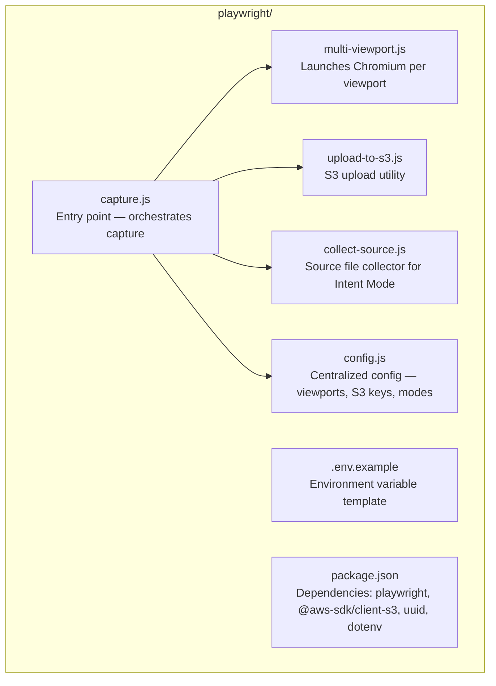
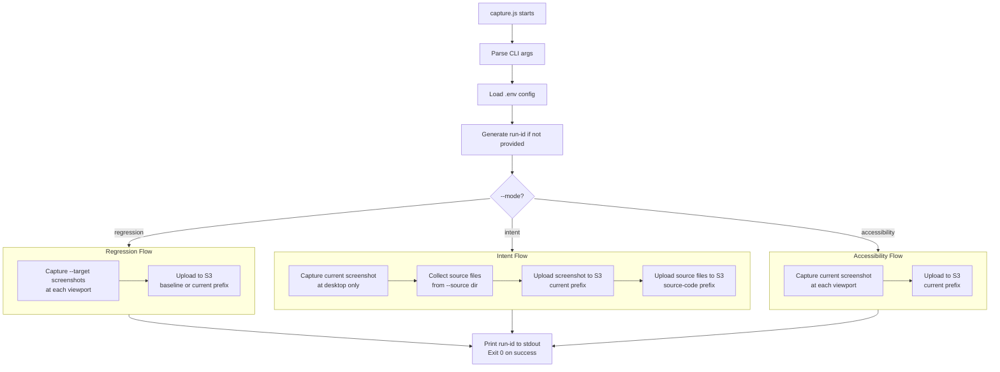

# Component Design — Playwright Capture Module

> Responsible for launching browsers, capturing screenshots at multiple viewports, collecting source files, and uploading everything to S3.

---

## Module Structure



---

## Capture Script — `capture.js`

### Responsibility
Entry point. Reads CLI flags, orchestrates the capture pipeline, calls viewport capture and S3 upload.

### CLI Interface

```
npm run capture -- [options]

Options:
  --mode        regression | intent | accessibility  (required)
  --target      baseline | current                   (required for regression)
  --url         URL to capture                       (default: http://localhost:3000)
  --source      Path to source files dir             (required for intent mode)
  --viewports   desktop,tablet,mobile                (default: desktop,mobile)
  --run-id      UUID for this run                    (auto-generated if omitted)
```

### Execution Flow



---

## Multi-Viewport Module — `multi-viewport.js`

### Viewport Definitions

| Name | Width | Height | Device scale | Use case |
|---|---|---|---|---|
| `desktop` | 1280px | 800px | 1x | Primary — all modes |
| `tablet` | 768px | 1024px | 1x | Optional via config |
| `mobile` | 375px | 812px | 2x | Primary — all modes |

### Capture Behavior
- Waits for `networkidle` before screenshotting (ensures fonts/images loaded)
- Full-page screenshot (not just viewport)
- PNG format, no compression
- Retry up to 2 times on failure before throwing

---

## Upload Module — `upload-to-s3.js`

### S3 Key Pattern

```
{prefix}/{run-id}/{viewport}/screenshot.png

Examples:
  baseline/abc-123/desktop/screenshot.png
  current/abc-123/mobile/screenshot.png
  annotated/abc-123/desktop/screenshot-annotated.png
  source-code/abc-123/CheckoutForm.jsx
```

### Upload Behavior
- Uses `@aws-sdk/client-s3` v3 with `PutObjectCommand`
- Reads credentials from environment variables (`AWS_ACCESS_KEY_ID`, `AWS_SECRET_ACCESS_KEY`, `AWS_REGION`)
- Sets `ContentType: image/png` for screenshots, `text/plain` for source files
- Returns the S3 key on success for use by Lambda

---

## Source Collector — `collect-source.js`

### File Filter
Recursively walks the `--source` directory and collects files matching:
- `*.jsx`, `*.tsx` — React components
- `*.css`, `*.module.css` — stylesheets
- `*.js`, `*.ts` — utilities (if colocated with component)

Excludes:
- `node_modules/`
- `build/`, `dist/`, `.next/`
- `*.test.*`, `*.spec.*`
- Files > 100KB

### Output
Each file uploaded as a separate S3 object under `source-code/{run-id}/filename`.

---

## Environment Variables

| Variable | Required | Description |
|---|---|---|
| `AWS_ACCESS_KEY_ID` | Yes | AWS credentials |
| `AWS_SECRET_ACCESS_KEY` | Yes | AWS credentials |
| `AWS_REGION` | Yes | e.g. `us-east-1` |
| `S3_BUCKET_NAME` | Yes | e.g. `visual-qa-inspector-images` |
| `BASELINE_URL` | No | Default baseline URL |
| `CURRENT_URL` | No | Default current URL |

---

## Dependencies

```json
{
  "dependencies": {
    "@aws-sdk/client-s3": "3.x",
    "@playwright/test": "1.x",
    "uuid": "9.x",
    "dotenv": "16.x",
    "commander": "12.x"
  }
}
```
