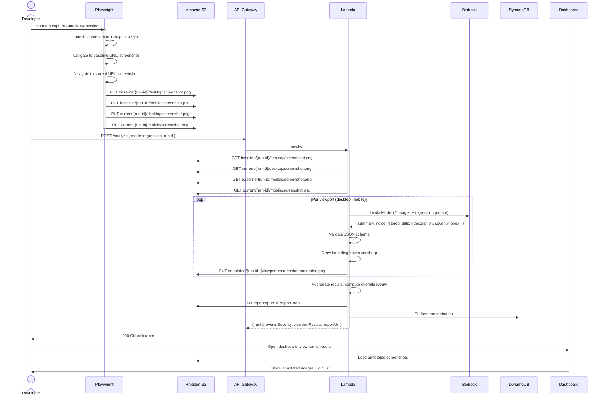
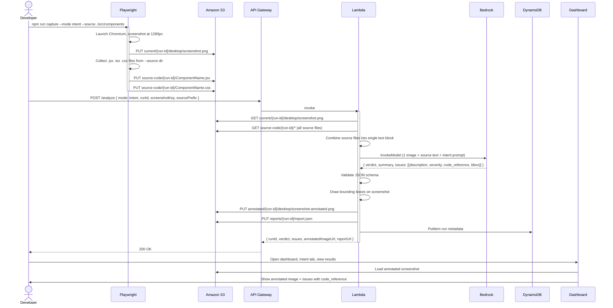
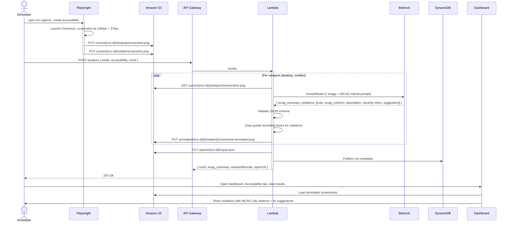
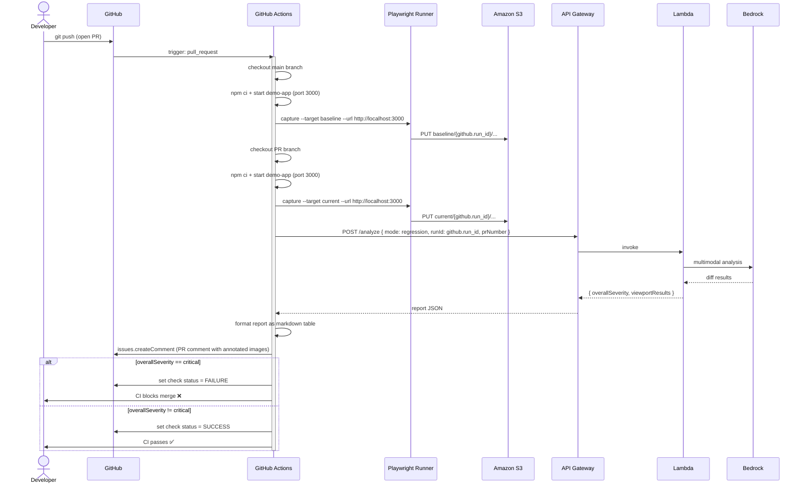
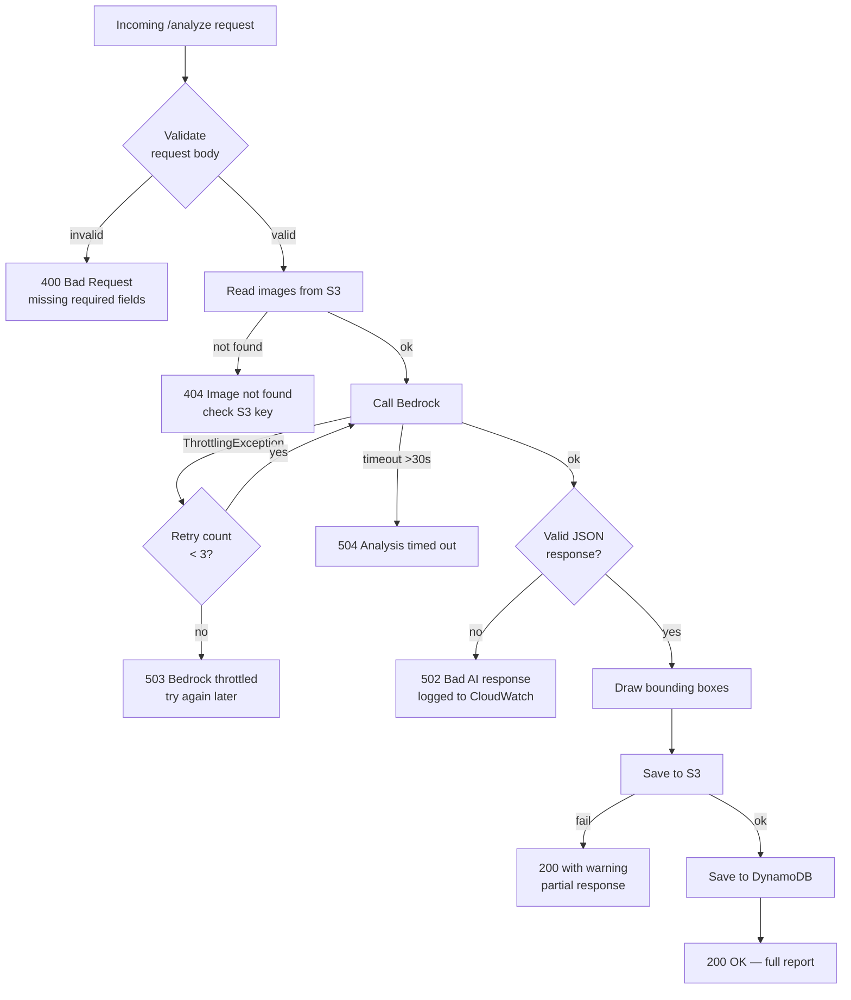

# Data Flow Diagrams — VisualQA Inspector

> Detailed step-by-step data flow for each of the three analysis modes.

---

## Mode A — Regression Mode

Compares a baseline screenshot against a current screenshot using LLM semantic reasoning.

---

## Mode B — Intent Mode (Zero-Baseline)

Evaluates a single screenshot against component source code. No baseline required.

---

## Mode C — Accessibility Mode

Evaluates a single screenshot against WCAG AA rules. No baseline, no source code needed.

---

## CI Mode — Automated PR Flow

How all three modes integrate with the GitHub Actions pipeline.

---

## Error Handling Flow

