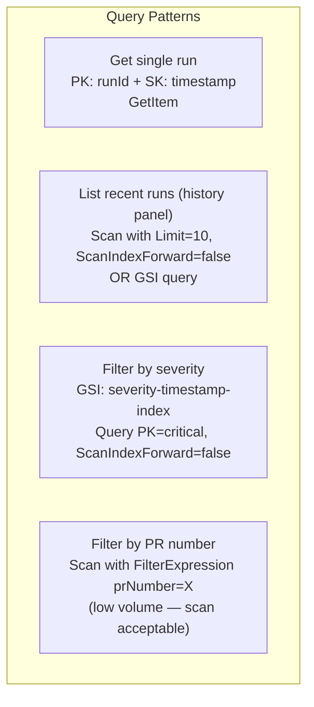
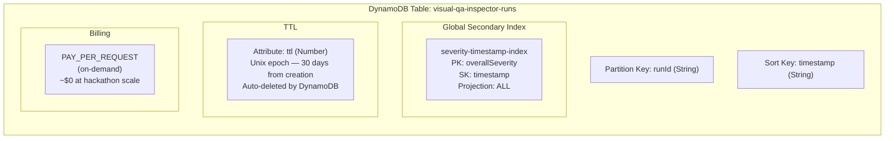
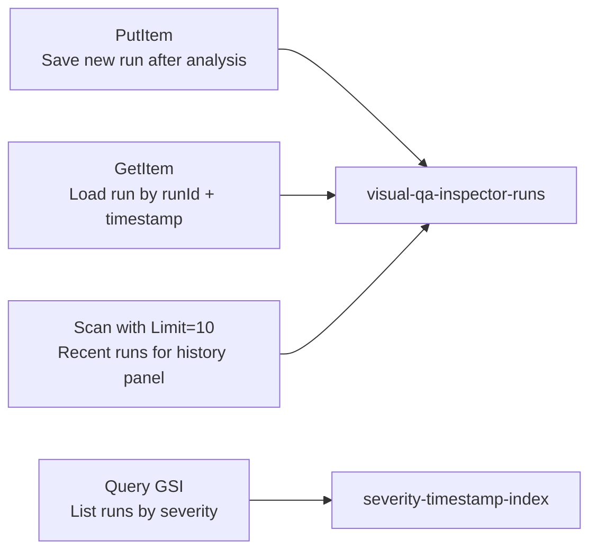

# Database Design — DynamoDB

> Single-table design for persisting analysis run metadata and enabling history queries.

---

## Table Overview

```mermaid
erDiagram
    RUNS {
        string runId PK "Partition Key — UUID v4"
        string timestamp SK "Sort Key — ISO 8601 e.g. 2026-07-25T03:00:00.000Z"
        string mode "regression OR intent OR accessibility"
        string overallSeverity "critical OR minor OR cosmetic OR pass"
        string reportUrl "https://s3.../reports/run-id/report.json"
        string baselineAnnotatedUrl "https://s3.../annotated/run-id/desktop/..."
        string mobileAnnotatedUrl "https://s3.../annotated/run-id/mobile/..."
        number diffsFound "total diffs across all viewports"
        number criticalCount "count of critical diffs"
        number minorCount "count of minor diffs"
        number cosmeticCount "count of cosmetic diffs"
        string prNumber "GitHub PR number — nullable"
        string repoFullName "owner/repo — nullable"
        string triggeredBy "ci OR manual"
        number durationMs "total analysis time in ms"
        string s3Prefix "top-level S3 prefix for this run"
        number ttl "Unix timestamp — auto-delete after 30 days"
    }
```

---

## Access Patterns



---

## Table Configuration



---

## Sample Items

### Regression run (CI-triggered)

```json
{
  "runId": { "S": "f3a8d2c1-4b5e-4f6a-9c7d-8e9f0a1b2c3d" },
  "timestamp": { "S": "2026-07-25T03:42:11.000Z" },
  "mode": { "S": "regression" },
  "overallSeverity": { "S": "critical" },
  "reportUrl": { "S": "https://s3.amazonaws.com/visual-qa-inspector-images/reports/f3a8d2c1/report.json" },
  "baselineAnnotatedUrl": { "S": "https://s3.amazonaws.com/.../annotated/f3a8d2c1/desktop/screenshot-annotated.png" },
  "mobileAnnotatedUrl": { "S": "https://s3.amazonaws.com/.../annotated/f3a8d2c1/mobile/screenshot-annotated.png" },
  "diffsFound": { "N": "3" },
  "criticalCount": { "N": "2" },
  "minorCount": { "N": "1" },
  "cosmeticCount": { "N": "0" },
  "prNumber": { "S": "42" },
  "repoFullName": { "S": "acme-corp/checkout-service" },
  "triggeredBy": { "S": "ci" },
  "durationMs": { "N": "4211" },
  "s3Prefix": { "S": "f3a8d2c1-4b5e-4f6a-9c7d-8e9f0a1b2c3d" },
  "ttl": { "N": "1724640131" }
}
```

### Accessibility run (manual)

```json
{
  "runId": { "S": "a1b2c3d4-e5f6-7890-abcd-ef1234567890" },
  "timestamp": { "S": "2026-07-25T04:15:00.000Z" },
  "mode": { "S": "accessibility" },
  "overallSeverity": { "S": "critical" },
  "reportUrl": { "S": "https://s3.amazonaws.com/.../reports/a1b2c3d4/report.json" },
  "baselineAnnotatedUrl": { "NULL": true },
  "mobileAnnotatedUrl": { "S": "https://s3.amazonaws.com/.../annotated/a1b2c3d4/mobile/screenshot-annotated.png" },
  "diffsFound": { "N": "4" },
  "criticalCount": { "N": "2" },
  "minorCount": { "N": "0" },
  "cosmeticCount": { "N": "0" },
  "prNumber": { "NULL": true },
  "repoFullName": { "NULL": true },
  "triggeredBy": { "S": "manual" },
  "durationMs": { "N": "3180" },
  "s3Prefix": { "S": "a1b2c3d4-e5f6-7890-abcd-ef1234567890" },
  "ttl": { "N": "1724643300" }
}
```

---

## DynamoDB Client — `dynamodb-client.js`

### Operations used



### TTL Calculation
```javascript
// Set TTL to 30 days from now
const ttl = Math.floor(Date.now() / 1000) + (30 * 24 * 60 * 60);
```

---

## History API — `GET /history`

Used by the dashboard history panel. Returns last 10 runs sorted newest first.

### Response

```json
{
  "runs": [
    {
      "runId": "f3a8d2c1-...",
      "timestamp": "2026-07-25T03:42:11.000Z",
      "mode": "regression",
      "overallSeverity": "critical",
      "diffsFound": 3,
      "triggeredBy": "ci",
      "prNumber": "42",
      "reportUrl": "https://..."
    }
  ],
  "count": 10
}
```

---

## Cost Projection

| Operation | Hackathon (100 runs) | Scale (10k runs/month) |
|---|---|---|
| PutItem | $0.00 | $0.01 |
| GetItem | $0.00 | $0.01 |
| Scan/Query | $0.00 | $0.02 |
| Storage | $0.00 | $0.01 |
| **Total** | **~$0** | **~$0.05** |

DynamoDB is effectively free at this scale on on-demand billing.
