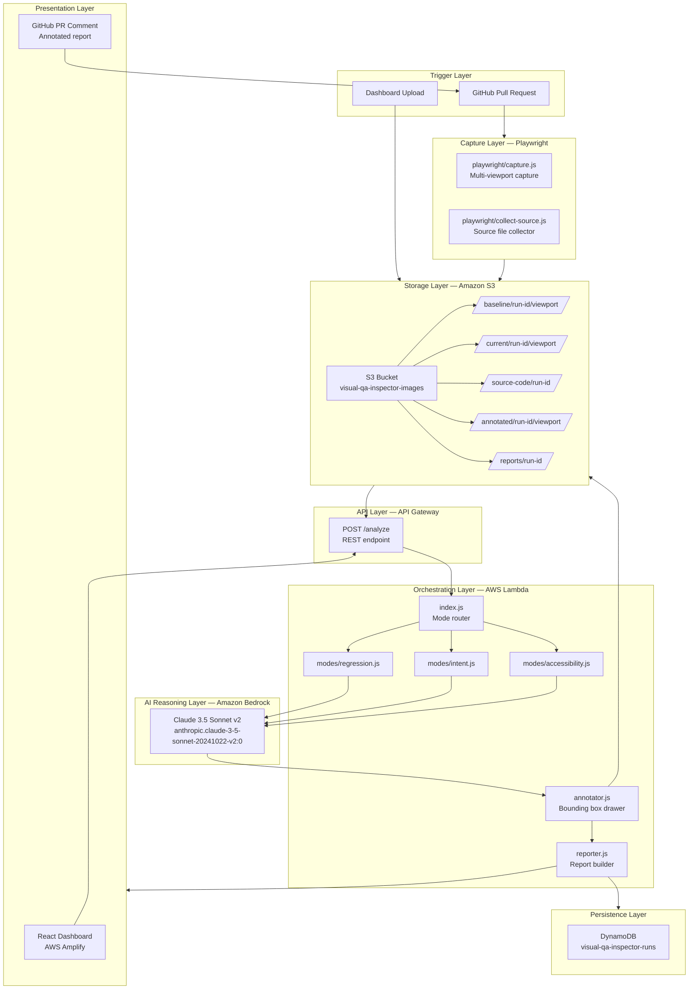
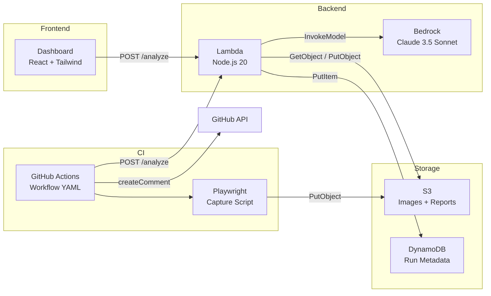
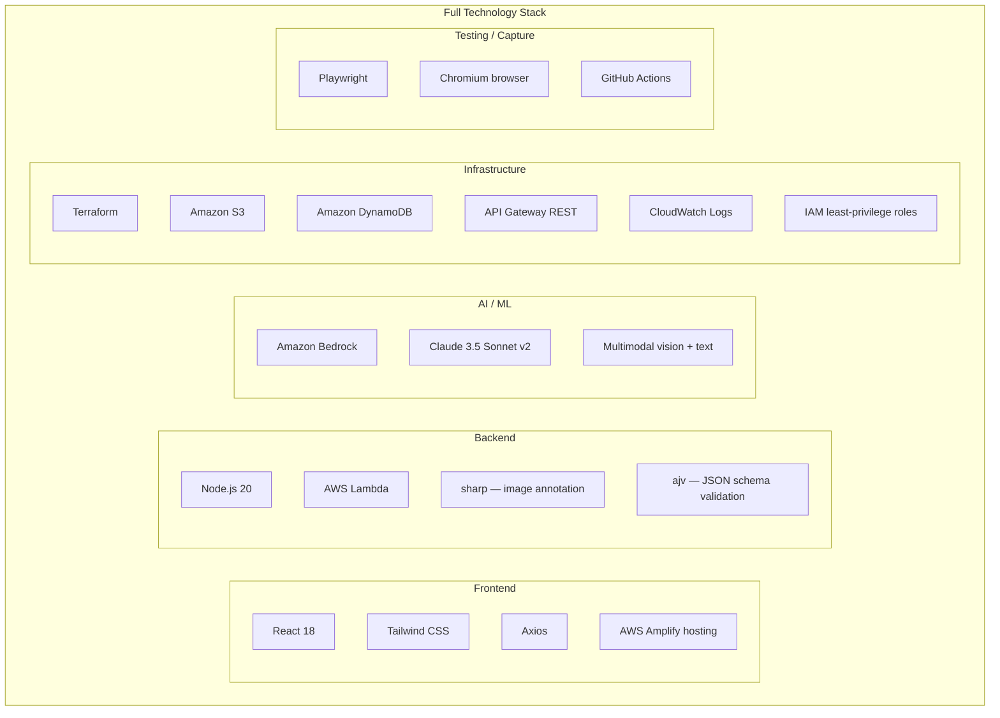
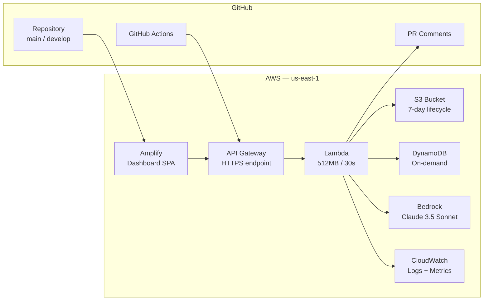

# System Architecture — VisualQA Inspector

> Full system overview showing all components, their relationships, and the technology stack.

---

## High-Level System Diagram

---

## Component Responsibilities

---

## Technology Stack

---

## Deployment Topology

